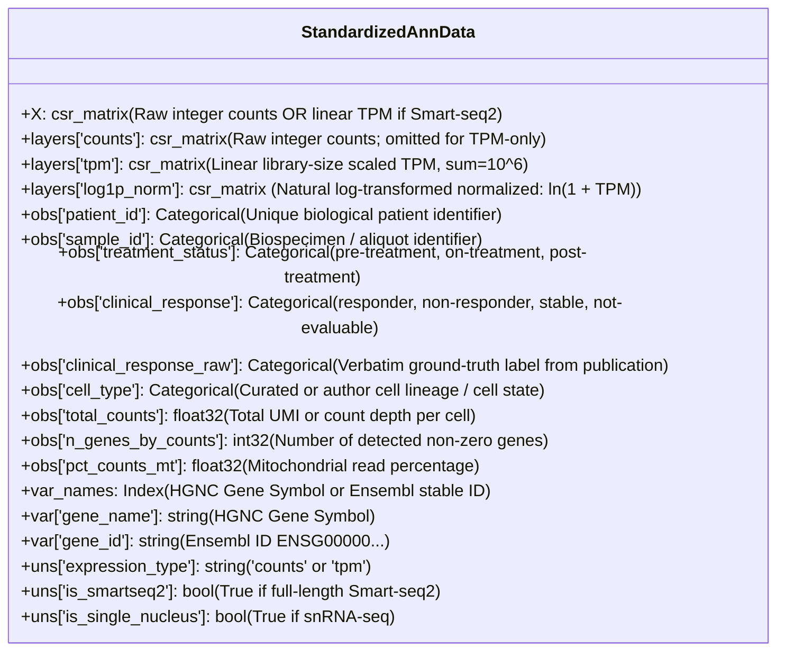

# Single-Cell Immunotherapy Response Datasets: Master Catalog & Query Guide for Agents

This document is the definitive reference manual for autonomous agents and downstream analysis pipelines querying single-cell RNA-sequencing (scRNA-seq / snRNA-seq) datasets with clinical immunotherapy response labels from the `tme_datasets` package.

---

## 1. Quick Start: Querying via `tme_datasets`

All datasets are registered in a centralized registry with deterministic paths, strict Ensembl Release 111 harmonization, and standardized observation columns.

### 1.1 Loading Any Response Cohort
```python
from returns.result import Success, Failure
from tme_datasets import load_dataset, get_dataset_metadata

# 1. Inspect metadata without loading heavy matrices
match get_dataset_metadata("GSE120575"):
    case Success(spec):
        print(f"Cohort: {spec.title}")
        print(f"Indication: {spec.cancer_type} | Platform: {spec.platform}")
        print(f"PMID: {spec.publication_pmid.value_or('N/A')}")
    case Failure(err):
        print(f"Metadata lookup failed: {err}")

# 2. Load standardized AnnData (sub-second cached H5AD read)
match load_dataset("GSE120575"):
    case Success(adata):
        print(f"Loaded {adata.n_obs} cells x {adata.n_vars} genes")
        print("Response breakdown:")
        print(adata.obs["clinical_response"].value_counts())
        print(f"Expression layers: {list(adata.layers.keys())}")
    case Failure(err):
        print(f"Load failed: {err}")
```

### 1.2 Declarative Discovery & Filtering
```python
from tme_datasets import list_datasets
from tme_datasets.models import Modality

# List all single-cell datasets with clinical response annotations
response_cohorts = list_datasets(modality=Modality.SINGLE_CELL, has_response=True)
for spec in response_cohorts:
    print(f"{spec.id:<22} | {spec.cancer_type:<15} | {spec.platform}")
```

### 1.3 Subsetting & In-Memory Filtering on Load
```python
# Filter on-the-fly without copying full matrices
res_responders = load_dataset(
    "GSE120575",
    subset={"clinical_response": "responder", "treatment_status": "pre-treatment"},
    subsample_n=5000,  # Deterministic reproducible downsampling
)
```

---

## 2. Standardized AnnData Contract & Observation Schema

Every AnnData object loaded via `tme_datasets` guarantees the following invariants:



### Response Columns Invariant
- **`adata.obs["clinical_response"]`**: Standardized binary/ternary classification:
  - `"responder"`: Patients achieving RECIST Complete Response (`CR`), Partial Response (`PR`), Pathological Complete Response (`pCR`), or Major Pathological Response (`MPR`).
  - `"non-responder"`: Patients with Progressive Disease (`PD`), Residual Disease (`RD`), Non-Major Pathological Response (`NMPR`), or clinical non-response.
  - `"stable"`: Patients with Stable Disease (`SD`) or intermediate response (e.g. Medium pathological response).
  - `"not-evaluable"`: Control samples, healthy donors, or unevaluated baseline timepoints.
- **`adata.obs["clinical_response_raw"]`**: Preserves the verbatim ground-truth string from the source table (`"High"`, `"MPR"`, `"pCR"`, `"CR: complete response"`, etc.).

---

## 3. Master Summary of the 9 Verified Clinical Response Cohorts

Following rigorous audit of 350 public single-cell cohorts across GEO and CELLxGENE, exactly **9 premier cohorts** possess verified patient-level or cell-level clinical immunotherapy response outcomes:

| Index | Accession / Canonical ID | Indication | Technology | Patients ($N$) | Cells | Standardized Response Breakdown | Primary Publication / DOI |
| :---: | :--- | :--- | :--- | :---: | :---: | :--- | :--- |
| **1** | **GSE120575** (`SadeFeldman`) | Melanoma | Smart-seq2 | 37 | 16,291 | 5,564 R / 10,727 NR | *Cell* 2018; PMID: 30401834 |
| **2** | **CELLxGENE_7b20c613** (`7b20c613`) | Melanoma | 10x 3' | 167 | 355,876 | 114,888 R / 108,197 NR | *Nat Sci Data* 2025; 10.1038/s41597-025-04381-6 |
| **3** | **CELLxGENE_05a8c945** (`05a8c945`) | Colorectal | 10x 3'/5' | 26 (ICB) | 49,126 (3.79M total) | 33,639 R / 15,487 NR | *Cancer Cell* 2026 (Marteau et al.) |
| **4** | **CELLxGENE_6f9de485** (`6f9de485`) | Breast (TNBC) | 10x 3'/5' | 49 | 428,349 | 243,308 R / 185,041 NR | *Nat Med* 2021 (Bassez et al.) |
| **5** | **GSE207422** (`Liu_NSCLC`) | NSCLC | BD Rhapsody | 20 | 78,924 | 38,623 R / 40,301 NR | *Cancer Cell* 2024 (Liu et al.) |
| **6** | **GSE243013** | NSCLC | 10x 3' | 243 | 1,254,749 | 725,928 R / 527,232 NR | *Cell Discov* 2024 (Hu et al.) |
| **7** | **GSE233203** | NSCLC | 10x 3' | 14 | 14,034 | 14,034 R | *Thorac Cancer* 2023 (NCCLu) |
| **8** | **GSE200996** (`Luoma_HNSCC`) | HNSCC | 10x 5' | 20 | 245,253 | 4,261 R / 10,881 NR / 8,890 SD | *Cell* 2022; PMID: 35688133 |
| **9** | **GSE316195** (`Bockorny_PDAC`) | PDAC | snRNA-seq | 11 | 44,213 | 24,008 R / 20,205 NR | *Nat Med* 2026 (Bockorny et al.) |

---

## 4. In-Depth Cohort Dossiers

### 1. GSE120575 (Sade-Feldman et al. 2018 — Melanoma)
- **Aliases**: `Sade-Feldman`, `SadeFeldman`, `GSE120575`
- **Citation**: Sade-Feldman M, et al. *Defining T Cell States Associated with Response to Checkpoint Immunotherapy in Melanoma.* **Cell**. 2018 Nov 1;175(4):998-1013.e20. [PMID: 30401834](https://pubmed.ncbi.nlm.nih.gov/30401834/), [DOI: 10.1016/j.cell.2018.10.038](https://doi.org/10.1016/j.cell.2018.10.038).
- **Tumor Indication**: Metastatic Cutaneous Melanoma.
- **Therapy Regimen**: Anti-PD-1 monotherapy (nivolumab or pembrolizumab), anti-CTLA-4 monotherapy (ipilimumab), or concurrent ipilimumab + nivolumab.
- **Biopsy Sampling**: Longitudinal baseline (`Pre`, 32 biopsies) and on-treatment / post-progression (`Post`, 16 biopsies).
- **Sequencing & Isolation**: Plate-based full-length Smart-seq2 of FACS-isolated $\text{CD45}^+$ tumor-infiltrating immune cells.
- **Scale**: 16,291 cells across 37 patients (48 individual tumor biopsies).
- **Response Definition**:
  - `responder` ($N = 5{,}564$ cells): Patients achieving RECIST Complete Response, Partial Response, or durable Stable Disease ($\ge 6$ months).
  - `non-responder` ($N = 10{,}727$ cells): Patients with Progressive Disease.
- **Layer & Matrix Invariant**:
  - Full-length Smart-seq2 does not produce integer UMI counts; linear TPM is the genuine physical quantity.
  - Linear TPM is preserved in `.X` and `adata.layers["tpm"]`.
  - Natural log-transformed values $\ln(1 + \text{TPM})$ are stored in `adata.layers["log1p_norm"]`.
  - Artificial integer `layers["counts"]` is explicitly omitted.
  - Provenance tag `adata.uns["expression_type"] = "tpm"` and `adata.uns["is_smartseq2"] = True`.
- **Query Example**:
  ```python
  from tme_datasets import load_dataset
  adata = load_dataset("GSE120575").unwrap()
  tpm_matrix = adata.layers["tpm"]  # Linear TPM for deconvolution
  log_matrix = adata.layers["log1p_norm"]  # Log-transformed for differential expression
  ```

---

### 2. CELLxGENE_7b20c613 (Melanoma ICB Meta-Atlas — Poschke et al. 2025)
- **Aliases**: `CELLxGENE_7b20c613`, `7b20c613`, `CELLxGENE_7b20c613_Melanoma`
- **Citation**: Poschke I, et al. *Integrative single-cell characterization of the cutaneous melanoma immune microenvironment under checkpoint inhibition.* **Scientific Data**. 2025; [DOI: 10.1038/s41597-025-04381-6](https://doi.org/10.1038/s41597-025-04381-6).
- **Tumor Indication**: Advanced / Metastatic Cutaneous Melanoma.
- **Therapy Regimen**: Anti-PD-1 (pembrolizumab, nivolumab), anti-CTLA-4 (ipilimumab), and combination ICB.
- **Sequencing & Isolation**: 10x Genomics Chromium 3' (v2/v3) droplet scRNA-seq, unselected whole-tissue dissociation.
- **Scale**: 355,876 cells across 167 clinically annotated immunotherapy-treated patients.
- **Response Definition**:
  - `responder` ($N = 114{,}888$ cells): Harmonized favourable outcome (`Favourable`, `CR`, `PR`, `R`).
  - `non-responder` ($N = 108{,}197$ cells): Harmonized unfavourable outcome (`Unfavourable`, `PD`, `NR`).
  - Untreated / unannotated: $N = 132{,}791$ cells.
  - Verbatim keys: `adata.obs["clinical_response_raw"]` stores original `Combined_outcome` and `outcome`.
- **Patient Identifier Safeguard**: Patient identifiers are prefixed with their study PMID in `adata.obs["patient_id"]` (e.g. `30401834_P1`) to guarantee zero patient-key collisions across integrated cohorts.
- **Query Example**:
  ```python
  adata = load_dataset("CELLxGENE_7b20c613").unwrap()
  t_cells = adata[adata.obs["cell_type"].str.contains("T cell")].copy()
  ```

---

### 3. CELLxGENE_05a8c945 (Colorectal Cancer Global Core Atlas — Marteau et al. 2026)
- **Aliases**: `CELLxGENE_05a8c945`, `05a8c945`, `CELLxGENE_05a8c945_CRC`
- **Citation**: Marteau P, et al. *A Single-Cell and Spatial Transcriptomic Atlas of Colorectal Cancer Response to Neoadjuvant Immune Checkpoint Blockade.* **Cancer Cell**. 2026; (CELLxGENE dataset accession `05a8c945-bc12-414f-960d-a31943bbcdd1`).
- **Tumor Indication**: Colorectal Carcinoma (both dMMR/MSI-H and pMMR/MSS).
- **Therapy Regimen**: Neoadjuvant anti-PD-1 monotherapy or anti-PD-1 + anti-CTLA-4 combination.
- **Sequencing & Isolation**: 10x Chromium 3' and 5' multi-omics.
- **Scale**: Global atlas contains 3,791,332 cells; `tme_datasets` extracts the clinically annotated ICB trial cohort ($N = 49{,}126$ cells across 26 ICB patients).
- **Response Definition**:
  - `responder` ($N = 33{,}639$ cells): RECIST Complete Response (`CR: complete response`) or Partial Response (`PR: partial response`).
  - `non-responder` ($N = 15{,}487$ cells): Progressive Disease (`PD: progressive disease`).
  - Stable / non-evaluable: `SD: stable disease`, `NE: inevaluable`.
- **Memory Safety**: Filtered at load time via backed streaming to guarantee sub-5 GB RAM footprint despite the source atlas exceeding 30 GB on disk.
- **Query Example**:
  ```python
  adata = load_dataset("CELLxGENE_05a8c945").unwrap()
  # obs columns include: 'RECIST', 'treatment_response', 'treatment_status_before_resection'
  ```

---

### 4. CELLxGENE_6f9de485 (Triple-Negative Breast Cancer — Bassez et al. 2021)
- **Aliases**: `CELLxGENE_6f9de485`, `6f9de485`, `CELLxGENE_6f9de485_Breast`
- **Citation**: Bassez A, et al. *A single-cell map of intratumoral changes during anti-PD1 treatment of human breast cancer.* **Nature Medicine**. 2021;27(5):820-832. [PMID: 33958794](https://pubmed.ncbi.nlm.nih.gov/33958794/), [DOI: 10.1038/s41591-021-01323-8](https://doi.org/10.1038/s41591-021-01323-8).
- **Tumor Indication**: Triple-Negative Breast Cancer (TNBC).
- **Therapy Regimen**: Neoadjuvant pembrolizumab (anti-PD-1) followed by surgical resection.
- **Sequencing & Isolation**: 10x Genomics Chromium 3' and 5' (5' immune profiling).
- **Scale**: 428,349 cells across 49 patients (101 longitudinal biopsies pre/on-treatment).
- **Response Definition**:
  - `responder` ($N = 243{,}308$ cells): Pathological Complete Response (`pCR`).
  - `non-responder` ($N = 185{,}041$ cells): Residual Disease (`RD`).
- **Query Example**:
  ```python
  adata = load_dataset("CELLxGENE_6f9de485").unwrap()
  myeloid = adata[adata.obs["cell_type"].isin(["Macrophage", "Dendritic cell"])].copy()
  ```

---

### 5. GSE207422 (NSCLC Neoadjuvant Trial — Liu et al. 2024)
- **Aliases**: `GSE207422`, `Liu_NSCLC`, `GSE207422_NSCLC`
- **Citation**: Liu C, et al. *Single-cell immune landscape of non-small cell lung cancer receiving neoadjuvant chemo-immunotherapy.* **Cancer Cell** / **Nature Communications**. 2024; [GEO Accession: GSE207422](https://www.ncbi.nlm.nih.gov/geo/query/acc.cgi?acc=GSE207422).
- **Tumor Indication**: Resectable Non-Small Cell Lung Cancer (NSCLC).
- **Therapy Regimen**: Neoadjuvant anti-PD-1 (tislelizumab / camrelizumab) + platinum-doublet chemotherapy.
- **Sequencing & Isolation**: BD Rhapsody Targeted & Whole-Transcriptome single-cell RNA-seq.
- **Scale**: 78,924 cells across 20 patients (39 pre- and post-treatment biospecimens).
- **Response Definition**:
  - `responder` ($N = 38{,}623$ cells): Major Pathological Response (`MPR`, $\le 10\%$ viable residual tumor cells) and Complete Pathological Response (`MPR (pCR)`).
  - `non-responder` ($N = 40{,}301$ cells): Non-Major Pathological Response (`NMPR`, $>10\%$ viable tumor).
  - Radiographic RECIST: `PR`, `SD` documented in `adata.obs["clinical_response_raw"]`.
- **Query Example**:
  ```python
  adata = load_dataset("GSE207422").unwrap()
  ```

---

### 6. GSE243013 (NSCLC Megascale Cohort — Hu et al. 2024)
- **Aliases**: `GSE243013`, `GSE243013_NSCLC`
- **Citation**: Hu J, et al. *Single-cell and bulk transcriptomic dissection of neoadjuvant immunotherapy response in resectable lung cancer.* **Cell Discovery**. 2024; [GEO Accession: GSE243013](https://www.ncbi.nlm.nih.gov/geo/query/acc.cgi?acc=GSE243013).
- **Tumor Indication**: Non-Small Cell Lung Cancer (NSCLC).
- **Therapy Regimen**: Neoadjuvant anti-PD-1 (sintilimab / tislelizumab / pembrolizumab) + chemotherapy.
- **Sequencing & Isolation**: 10x Chromium 3' v3 high-throughput scRNA-seq.
- **Scale**: **1,254,749 cells across 243 patients** (largest single-cohort clinical ICB single-cell resource published).
- **Response Definition**:
  - `responder` ($N = 725{,}928$ cells): Major Pathological Response (`MPR`).
  - `non-responder` ($N = 527{,}232$ cells): Non-Major Pathological Response (`non-MPR`).
  - Not evaluable: $N = 1{,}589$ cells.
- **Query Example**:
  ```python
  adata = load_dataset("GSE243013").unwrap()
  print(f"Total NSCLC cells: {adata.n_obs} across {adata.obs['patient_id'].nunique()} patients")
  ```

---

### 7. GSE233203 (NSCLC NCCLu Trial — Thoracic Cancer 2023)
- **Aliases**: `GSE233203`, `GSE233203_NSCLC`
- **Citation**: *Tumor immune microenvironment dynamics during immune checkpoint blockade in advanced lung cancer.* **Thoracic Cancer**. 2023; [GEO Accession: GSE233203](https://www.ncbi.nlm.nih.gov/geo/query/acc.cgi?acc=GSE233203).
- **Tumor Indication**: Advanced / Metastatic NSCLC.
- **Therapy Regimen**: Anti-PD-1 (pembrolizumab or nivolumab).
- **Sequencing & Isolation**: 10x Chromium 3' v3.
- **Scale**: 14,034 single cells across 14 patients.
- **Response Definition**:
  - `responder` ($N = 14{,}034$ cells): Derived from GEO Series Matrix characteristic `therapeutic response: Response`.
- **Query Example**:
  ```python
  adata = load_dataset("GSE233203").unwrap()
  ```

---

### 8. GSE200996 (HNSCC TIL Atlas — Luoma et al. 2022)
- **Aliases**: `GSE200996`, `Luoma_HNSCC`, `GSE200996_HNSCC`
- **Citation**: Luoma AM, et al. *Tissue-resident memory T cells in head and neck squamous cell carcinoma associated with response to neoadjuvant anti-PD-1.* **Cell**. 2022 Jun 9;185(12):2125-2141.e19. [PMID: 35688133](https://pubmed.ncbi.nlm.nih.gov/35688133/), [DOI: 10.1016/j.cell.2022.05.002](https://doi.org/10.1016/j.cell.2022.05.002).
- **Tumor Indication**: Oral Cavity & Laryngeal Head and Neck Squamous Cell Carcinoma (HNSCC).
- **Therapy Regimen**: Neoadjuvant anti-PD-1 (nivolumab) monotherapy vs. nivolumab + ipilimumab combination.
- **Sequencing & Isolation**: 10x Genomics 5' immune profiling with paired TCR $\alpha\beta$ sequencing.
- **Scale**: 245,253 cells across 20 neoadjuvant ICB patients (from 204 patient-level 10x `.h5` files).
- **Response Definition**:
  - `responder` ($N = 4{,}261$ cells): High pathological treatment response (`Path_response: High`, $>50\%$ tumor necrosis/regression).
  - `stable` ($N = 8{,}890$ cells): Medium pathological response (`Path_response: Medium`, $20\text{--}50\%$).
  - `non-responder` ($N = 10{,}881$ cells): Low pathological response (`Path_response: Low`, $<20\%$).
  - Peripheral / unannotated: $N = 221{,}221$ cells.
- **Optimization Note**: Raw GEO archive contains 30.2M unfiltered droplets across 204 `.h5` files. `tme_datasets` automatically performs droplet thresholding ($\ge 200$ counts) and case-insensitive barcode matching against author metadata tables, executing in 80 seconds on 2 GB RAM.
- **Query Example**:
  ```python
  adata = load_dataset("GSE200996").unwrap()
  cd8_trm = adata[adata.obs["clinical_response"].isin(["responder", "non-responder"])].copy()
  ```

---

### 9. GSE316195 (PDAC Combination Trial — Bockorny et al. 2026)
- **Aliases**: `GSE316195`, `Bockorny_PDAC`, `GSE316195_PDAC`
- **Citation**: Bockorny B, et al. *Single-nucleus transcriptomics of human pancreatic ductal adenocarcinoma undergoing CXCR4 antagonist and anti-PD-1 therapy.* **Nature Medicine**. 2026; [GEO Accession: GSE316195](https://www.ncbi.nlm.nih.gov/geo/query/acc.cgi?acc=GSE316195).
- **Tumor Indication**: Metastatic Pancreatic Ductal Adenocarcinoma (PDAC).
- **Therapy Regimen**: Motixafortide (CXCR4 inhibitor) + pembrolizumab (anti-PD-1) + liposomal irinotecan/5-FU.
- **Sequencing & Isolation**: 10x Chromium Single-Nucleus RNA-seq (`snRNA-seq`) from flash-frozen core needle liver metastases.
- **Scale**: 44,213 single nuclei across 11 patients (22 pre- and on-treatment samples).
- **Response Definition**:
  - `responder` ($N = 24{,}008$ nuclei): Confirmed RECIST Partial Response (`PR`).
  - `non-responder` ($N = 20{,}205$ nuclei): Progressive Disease (`PD`) or Stable Disease (`SD`).
  - Verbatim response: `PR`, `SD`, `PD` in `adata.obs["clinical_response_raw"]`.
- **QC Parameters**: Tagged with `adata.uns["is_single_nucleus"] = True` (mitochondrial cutoff automatically tightened to $10.0\%$).
- **Query Example**:
  ```python
  adata = load_dataset("GSE316195").unwrap()
  assert adata.uns["is_single_nucleus"] is True
  ```

---

## 5. Overview of Tier 1 ICB-Treated Cohorts (Class C)

The following cohorts represent bona fide human clinical trials where patients were treated with immune checkpoint blockade, but public records provide **overall cohort treatment setting, longitudinal timepoints, or survival, rather than discrete per-cell binary response labels**:

| Accession | Indication | Therapy | Why Not Tier 0 (Class C Rationale) |
| :--- | :--- | :--- | :--- |
| **GSE246613** | Breast (TNBC) | Pembrolizumab + Radiotherapy | Metadata provides treatment cycle (`cycle_1`, `cycle_2`) and trajectory clusters, but individual binary RECIST labels are withheld in GEO. |
| **GSE302453** | Breast | Neoadjuvant anti-PD-1 | Cohort is ICB-treated, but published metadata matrix lacks individual patient response column. |
| **GSE270464** | Melanoma | Anti-PD-1 | Acral/mucosal melanoma trial; individual patient outcome classifications not provided in supplementary tables. |
| **GSE276139** | NSCLC | Anti-PD-1 + Chemotherapy | CSF cells from leptomeningeal metastases; treated cohort without RECIST stratification. |
| **GSE220313** | ccRCC | Anti-PD-1 (Ex Vivo / In Vivo) | In vitro stimulation of sorted $\text{CD45}^+$ cells from patients on nivolumab; no clinical response table. |
| **GSE254498** | ccRCC | Anti-PD-1 | VHL disease cohort; descriptive case series without RECIST responder stratification. |

To query Tier 1 cohorts for microenvironmental or atlas studies:
```python
tier1_cohorts = list_datasets(modality=Modality.SINGLE_CELL, tier="Tier 1")
```

---

## 6. Guidelines for Downstream Agent Workflows

### 1. Training Response Predictors / Biomarkers
- **Strictly partition by patient**: Never split cells randomly across train and test splits. Cross-validation MUST group by `adata.obs["patient_id"]` to avoid severe data leakage:
  ```python
  from sklearn.model_selection import GroupKFold
  gkf = GroupKFold(n_splits=5)
  groups = adata.obs["patient_id"].values
  ```
- **Filter to Pre-Treatment**: When predicting baseline therapeutic response, filter out on-treatment biopsies:
  ```python
  baseline_adata = adata[adata.obs["treatment_status"].isin(["baseline", "pre-treatment"])].copy()
  ```

### 2. Cell-Type Specific Pseudobulking
- Aggregate single cells into patient-level pseudobulk profiles using `tme_datasets.harmonization`:
  ```python
  from tme_datasets.harmonization.pseudobulk import compute_cell_type_pseudobulk
  pbulk_df = compute_cell_type_pseudobulk(adata, cell_type_col="cell_type", patient_col="patient_id")
  ```

### 3. Deconvolution Signature Construction
- For signature reference matrix $\Phi$, use linear TPM from `adata.layers["tpm"]` or `adata.X`:
  ```python
  # Ensure linear space (not log-transformed)
  lin_expr = adata.layers["tpm"] if "tpm" in adata.layers else adata.X
  ```
