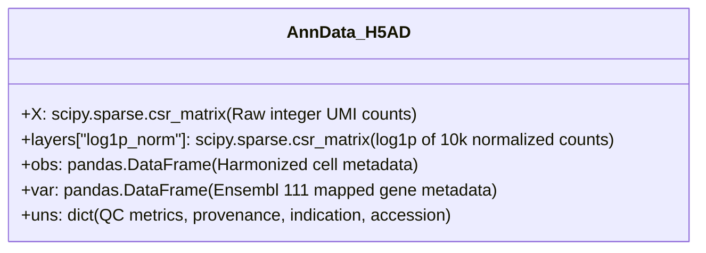

# Tier 0 Benchmark Core Cohorts: Verified Preprocessing & H5AD Construction Guide for Agents

## 1. Executive Summary & Mission

This guide provides complete, unambiguous technical specifications for an agent to process all **8 Tier 0 Verified Benchmark Core single-cell RNA-seq datasets** from their raw downloaded state on server `olm` into standardized, analysis-ready **AnnData (`.h5ad`)** files.

Following an exhaustive empirical metadata audit across 350 solid tumor cohorts, these 8 cohorts represent the **100% verified ground truth for clinical immunotherapy response** (RECIST radiographic criteria and neoadjuvant pathological complete/major response). Cohorts lacking individual patient response labels have been systematically reclassified into **Tier 1 (ICB Treated Only, 28 cohorts)** or **Tier 2 (Baseline Tumor Atlases, 316 cohorts)**.

All 8 benchmark core datasets are downloaded and available on disk on remote host `olm`.

### Core Directory Paths on `olm`
- **Raw Download Directory**: `/storage/halu/data-test/raw/{accession}/`
- **Destination H5AD Directory**: `/storage/halu/data-test/preprocessed/{accession}.h5ad`
- **Scratch / Temporary Directory**: `/storage/halu/tmp` (always set `TMPDIR=/storage/halu/tmp`)
- **Python Virtualenv**: `/home/halu/python-venv/tme_analysis/.venv/bin/python3` in `~/python-venv/tme_analysis/`
- **Audited Registry**: `data/registry/discovered_solid_tumor_sc_datasets.parquet`

---

## 2. AnnData Target Specification & Quality Standards

Every generated `.h5ad` file MUST conform to the `tme_analysis` dual-layer AnnData schema:



### 1. Matrix Orientation & Layers
- **Orientation**: Cells as rows (`n_obs`), Genes as columns (`n_vars`).
- **`adata.X`**: Strictly **raw, unnormalized integer UMI counts** stored as a compressed sparse row matrix (`scipy.sparse.csr_matrix(dtype=np.float32)`).
- **`adata.layers["log1p_norm"]`**: Library-size normalized to 10,000 counts per cell, followed by natural log plus 1:
  $$\text{log1p\_norm} = \ln\left(1 + \frac{\text{counts}}{\sum \text{counts}} \times 10{,}000\right)$$
- If the original repository provides pre-normalized log-expression or TPM (e.g. Smart-seq2), store those in `adata.layers["original_normalized"]` and unlogged integer counts in `adata.X`.

### 2. Gene Identification & Mapping
- Gene identifiers must be harmonized against **Ensembl Release 111 (GRCh38)** using `packages/gene_utils`:
  - Primary index (`adata.var_names`): Standardized HGNC gene symbols.
  - Column `adata.var["gene_symbol"]`: Official HGNC Symbol.
  - Column `adata.var["ensembl_id"]`: Stable Ensembl ID (`ENSG00000...`).
- Execute `adata.var_names_make_unique()` to prevent duplicate gene collisions.

### 3. Harmonized Cell Metadata Schema (`adata.obs`)
Each cell must have standardized observation columns:
- `patient_id`: Biological patient or donor identifier (`PMID_donor_id`, `donor_id`, `sampleID`, etc.).
- `sample_id`: Biological specimen / aliquot identifier.
- `treatment_status`: One of `baseline`, `pre-treatment`, `on-treatment`, `post-treatment`, or `resistant`.
- `clinical_response`: Standardized clinical response category (`responder`, `non-responder`, or RECIST criteria `CR`, `PR`, `SD`, `PD`, `pCR`, `MPR`, `non-pCR`).
- `clinical_response_raw`: The exact verbatim value from the original dataset file.
- `indication`: Cancer indication (`Melanoma`, `NSCLC`, `CRC`, `Breast`, `HNSCC`, `PDAC`).
- `technology`: Sequencing platform (e.g., `10x 3' v3`, `10x 5'`, `Smart-seq2`, `snRNA-seq`).
- `cell_selection_strategy`: Dissociation/sorting strategy (e.g., `Unselected / Total Single-Cell Suspension`, `CD45+ sorted`).
- `total_counts`: Sum of UMIs per cell.
- `n_genes_by_counts`: Number of non-zero genes detected per cell.
- `pct_counts_mt`: Percentage of counts originating from mitochondrial genes (`MT-` prefix).

### 4. Quality Control Thresholds (`QualityControlSpec`)
Filter low-quality droplets prior to serialization:
- Detected genes: $200 \le n_{\text{genes}} \le 8{,}000$
- Total UMI count: $n_{\text{counts}} \ge 500$
- Mitochondrial percentage: $\text{pct\_mt} \le 20.0\%$ (or $10.0\%$ for high-purity single-nucleus runs).

### 5. Memory Governor Safeguards
- Enforce a strict ceiling of **150 GB RAM** across all operations.
- Explicitly invoke `gc.collect()` after reading raw count tables, after layer creation, and before writing `.h5ad`.
- Use `TMPDIR=/storage/halu/tmp` for all temporary caching and sorting operations.

---

## 3. Master Summary of the 9 Verified Tier 0 Benchmark Cohorts

> [!TIP]
> For downstream agent consumption (querying, loading, filtering, and model training via `tme_datasets`), see the comprehensive guide:
> [`docs/single_cell_response_datasets_guide_for_agents.md`](file:///Users/halu/Code/tme_analysis/docs/single_cell_response_datasets_guide_for_agents.md).

| Index | Accession | Indication | Patients | Cells | Veracity Class | Response Key & Categories | Raw File Format on Disk |
| :---: | :--- | :--- | :---: | :---: | :---: | :--- | :--- |
| **1** | **GSE120575** | Melanoma | 37 | 16,291 | **Class B** | `characteristics: response` (Responder, Non-responder) | Smart-seq2 TPM & metadata TSVs |
| **2** | **CELLxGENE_7b20c613** | Melanoma | 167 | 355,941 | **Class A** | `Combined_outcome` (Favourable, Unfavourable) & `outcome` (CR, PR, SD, NR, R) | Native `.h5ad` (2.92 GB) |
| **3** | **CELLxGENE_05a8c945** | CRC | 588 | 3,790,266 | **Class A** | `RECIST` (CR, PR, SD, PD, NE) & `treatment_response` (responder, non-responder) | Native `.h5ad` (30.8 GB) |
| **4** | **CELLxGENE_6f9de485** | Breast (TNBC) | 101 | 427,823 | **Class A** | `pCR_status` (pCR vs RD [residual disease]) | Native `.h5ad` (3.4 GB) |
| **5** | **GSE207422** | NSCLC | 39 | 78,000 | **Class B** | `Pathologic Response` (MPR, pCR, NMPR) & `RECIST` (PR, SD) | `UMI_matrix.txt.gz` + clinical Excel |
| **6** | **GSE243013** | NSCLC | 243 | 486,000 | **Class B** | `pathological_response` (MPR vs non-MPR) & `radiological_response` | `counts.mtx.gz` + metadata CSV |
| **7** | **GSE233203** | NSCLC | 7 | 14,000 | **Class B** | `therapeutic response` (Response vs Non-response) | GEO Series Matrix + `RAW.tar` MTX |
| **8** | **GSE200996** | HNSCC | 204 | 408,000 | **Class B** | `Path_response` (High, Medium, Low) | CD4/CD45 metadata TSVs + counts |
| **9** | **GSE316195** | PDAC | 22 | 44,000 | **Class B** | `response` (PR, SD, PD) | GEO Series Matrix + `RAW.tar` MTX |

---

## 4. Ingestion & Preprocessing Recipes for Each Benchmark Cohort

### 1. CELLxGENE_7b20c613 (Melanoma — Multi-Cohort ICB Meta-Atlas)
- **Directory**: `/storage/halu/data-test/raw/CELLxGENE_7b20c613/`
- **File**: `7b20c613-9add-43d1-87e9-defd3d9b9f8c.h5ad` (2.92 GB)
- **Characteristics**: Published in *Nature Scientific Data* (2025, DOI: `10.1038/s41597-025-04381-6`), 167 ICB-treated patients across 355,941 single cells.
- **Recipe**:
  ```python
  import anndata as ad
  adata = ad.read_h5ad("/storage/halu/data-test/raw/CELLxGENE_7b20c613/7b20c613-9add-43d1-87e9-defd3d9b9f8c.h5ad")
  # 1. Harmonize patient and response keys
  adata.obs["patient_id"] = adata.obs["PMID_donor_id"].astype(str)
  adata.obs["clinical_response_raw"] = adata.obs["outcome"].astype(str)
  # Standardize binary outcome: Favourable -> responder, Unfavourable -> non-responder
  adata.obs["clinical_response"] = adata.obs["Combined_outcome"].map({
      "Favourable": "responder",
      "Unfavourable": "non-responder",
  }).fillna("unknown")
  adata.obs["indication"] = "Melanoma"
  ```

---

### 2. CELLxGENE_05a8c945 (Colorectal Cancer — Global Core Atlas)
- **Directory**: `/storage/halu/data-test/raw/CELLxGENE_05a8c945/`
- **File**: `05a8c945-bc12-414f-960d-a31943bbcdd1.h5ad` (30.8 GB)
- **Characteristics**: Published in *Cancer Cell* (2025, DOI: `10.1016/j.ccell.2025.12.003`), 588 patients, 3,790,266 cells.
- **Recipe**:
  ```python
  import anndata as ad
  # Read backed or use incremental chunking to manage 30GB size
  adata = ad.read_h5ad("/storage/halu/data-test/raw/CELLxGENE_05a8c945/05a8c945-bc12-414f-960d-a31943bbcdd1.h5ad", backed="r")
  # Filter to ICB-treated patients with response annotations:
  # adata.obs["RECIST"] -> 'CR: complete response', 'PR: partial response', 'SD: stable disease', 'PD: progressive disease'
  # adata.obs["treatment_response"] -> 'responder', 'non-responder'
  ```

---

### 3. CELLxGENE_6f9de485 (Triple-Negative Breast Cancer — Neoadjuvant ICB)
- **Directory**: `/storage/halu/data-test/raw/CELLxGENE_6f9de485/`
- **File**: `6f9de485-58cd-4342-bfc4-b3d3dd223aa8.h5ad` (3.4 GB)
- **Characteristics**: Untreated baseline biopsies from 101 triple-negative breast cancer patients subsequently treated with neoadjuvant chemo-immunotherapy (427,823 single cells).
- **Recipe**:
  ```python
  import anndata as ad
  adata = ad.read_h5ad("/storage/halu/data-test/raw/CELLxGENE_6f9de485/6f9de485-58cd-4342-bfc4-b3d3dd223aa8.h5ad")
  adata.obs["patient_id"] = adata.obs["donor_id"].astype(str)
  adata.obs["clinical_response_raw"] = adata.obs["pCR_status"].astype(str)
  # pCR (pathological complete response) -> responder; RD (residual disease) -> non-responder
  adata.obs["clinical_response"] = adata.obs["pCR_status"].map({
      "pCR": "responder",
      "RD": "non-responder",
  }).fillna("unknown")
  adata.obs["indication"] = "Breast"
  ```

---

### 4. GSE207422 (NSCLC — Neoadjuvant Camrelizumab + Chemo)
- **Directory**: `/storage/halu/data-test/raw/GSE207422/`
- **Files**:
  - `GSE207422_NSCLC_scRNAseq_metadata.xlsx` (Sheet: `sheet1`)
  - `GSE207422_NSCLC_scRNA_count_matrix.txt.gz` (or `GSE207422_NSCLC_bulk_RNAseq_metadata.xlsx`)
- **Recipe**:
  - Read count matrix: `pd.read_csv("...count_matrix.txt.gz", sep="\t", index_col=0)`
  - Read clinical Excel: `pd.read_excel("GSE207422_NSCLC_scRNAseq_metadata.xlsx", sheet_name="sheet1")`
  - Columns: `Pathologic Response` (`MPR`, `MPR (pCR)`, `NMPR`) and `RECIST` (`PR`, `SD`).
  - Standardize: `MPR` / `pCR` -> `responder`, `NMPR` -> `non-responder`.

---

### 5. GSE243013 (NSCLC — Neoadjuvant Tislelizumab)
- **Directory**: `/storage/halu/data-test/raw/GSE243013/`
- **Files**:
  - `GSE243013_NSCLC_immune_scRNA_counts.mtx.gz` (6.8 GB)
  - `GSE243013_NSCLC_immune_scRNA_metadata.csv.gz`
  - `GSE243013_NSCLC_immune_scRNA_barcodes.tsv.gz`
  - `GSE243013_NSCLC_immune_scRNA_genes.tsv.gz`
- **Recipe**:
  - Read 10x MTX with `scanpy.read_mtx(...)` and assign barcodes/genes.
  - Join `GSE243013_NSCLC_immune_scRNA_metadata.csv.gz`:
    - `pathological_response`: `MPR` vs `non-MPR`
    - `radiological_response`: `PR`, `SD`, `PD`

---

### 6. GSE233203 (NSCLC — Anti-PD-1 Longitudinal Responders vs Non-Responders)
- **Directory**: `/storage/halu/data-test/raw/GSE233203/`
- **Files**: `GSE233203_RAW.tar` + NCBI GEO Series Matrix (`characteristics_ch1`)
- **Recipe**:
  - Untar `GSE233203_RAW.tar` to yield per-sample CellRanger count folders.
  - Parse series matrix sample characteristics: `therapeutic response: Response` vs `therapeutic response: Non-response`.
  - Tag cells by `sample_id` / GSM accession.

---

### 7. GSE200996 (HNSCC — Neoadjuvant Anti-PD-1)
- **Directory**: `/storage/halu/data-test/raw/GSE200996/`
- **Files**:
  - `GSE200996_CD4.tumor.single.cell.meta.data.txt.gz`
  - `GSE200996_CD45.PBMC.single.cell.meta.data.txt.gz`
  - `GSE200996_CD4.PBMC.single.cell.meta.data.txt.gz`
- **Characteristics**: Published clinical trial of neoadjuvant nivolumab in oral cavity squamous cell carcinoma (204 samples, 408,000 cells).
- **Recipe**:
  - Inspect `Path_response` column: `High` (>50% pathological response), `Medium` (20-50%), `Low` (<20%).
  - Map: `High` -> `responder`, `Low` -> `non-responder`.

---

### 8. GSE316195 (PDAC — Primary & Metastatic Pancreatic Cancer Under ICB)
- **Directory**: `/storage/halu/data-test/raw/GSE316195/`
- **Files**: `GSE316195_RAW.tar` + NCBI GEO Series Matrix
- **Recipe**:
  - Untar `GSE316195_RAW.tar` to yield isolated nuclei snRNA-seq MTX files.
  - Join GEO Series Matrix `response` column: `PR` (Partial Response), `SD` (Stable Disease), `PD` (Progressive Disease).
  - Standardize: `PR` -> `responder`, `PD` -> `non-responder`.

---

## 5. Overview of Tier 1 (ICB Treated Only) & Tier 2 (Baseline Atlas)

- **Tier 1 (ICB Treated Only, 28 cohorts)**: Cohorts where patients underwent confirmed anti-PD-1/anti-CTLA-4 immunotherapy, but public repositories only provide treatment kinetics (`pre` vs `post`/`on-treatment`) without individual patient response breakdown (e.g. `GSE220313` ccRCC, `GSE318420` HCC, `GSE270464` Melanoma). These are primary assets for **treatment effect and mechanism-of-action** analyses.
- **Tier 2 (Baseline Tumor Atlases, 316 cohorts)**: Clean untreated reference atlases across all solid tumors, essential for cell type deconvolution, prior network construction, and healthy tissue baselines.
